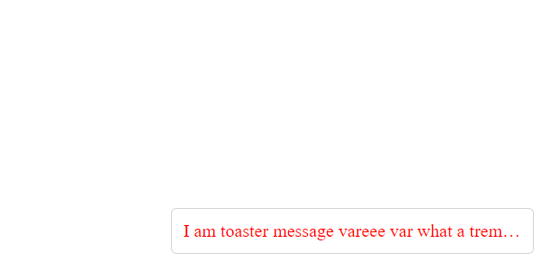

# vj-toaster

> To show popup message for warning, error, info.

## Final UI



## Install

```
 npm install vj-toaster -S
```

## Usage
```html
<vj-toaster length="5">
    <div slot="message">
        Hello this is default toaster message.
    </div>
</vj-toaster>
```

## Config

### message slot
For custom message to be displayed.

## License
MIT &copy; [Srinivasan K K](https://srinivasankk.com)