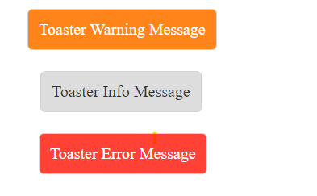

# vj-toaster

> To show toaster (popup) message for warning, error, info.

## Toaster UI



## Install

```
 npm install vj-toaster -S
```

## Usage
```html
<vj-toaster id="toasterId" type="error">
    <div slot="message">
        Toaster Error Message
    </div>
</vj-toaster>
```
By default, Toaster component is hidden. To enable it set `visible` property to true in the event handler of any HTML element.
```javascript
window.addEventListener('load', e => {
    document.getElementById('btn').addEventListener('click', e => {
        document.getElementById('toasterId').visible = !document.getElementById('toasterId').visible;
    });
});
```

## Config

### type
Type: `String`

Value: `'warning' | 'error' | 'info'`

Toaster web component type.

### visible
To show or hide the toaster web component.

### message slot
For custom message to be displayed.

## License
MIT &copy; [Srinivasan K K](https://srinivasankk.com)